# Automatic colorization

1. Download the generator and denoiser from extras
   

3. To colorize image or folder of images, use the following command:
```
$ python inference.py -p "path to file or folder"
```

| Original      | Colorization      |
|------------|-------------|
| 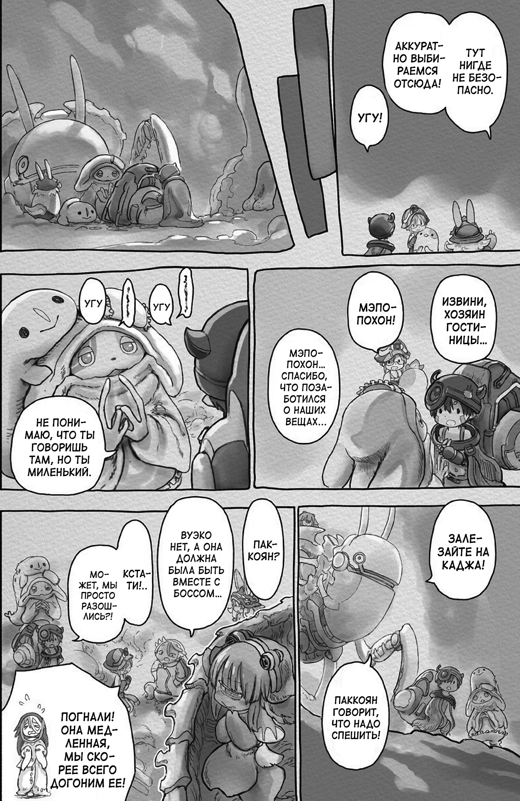 | 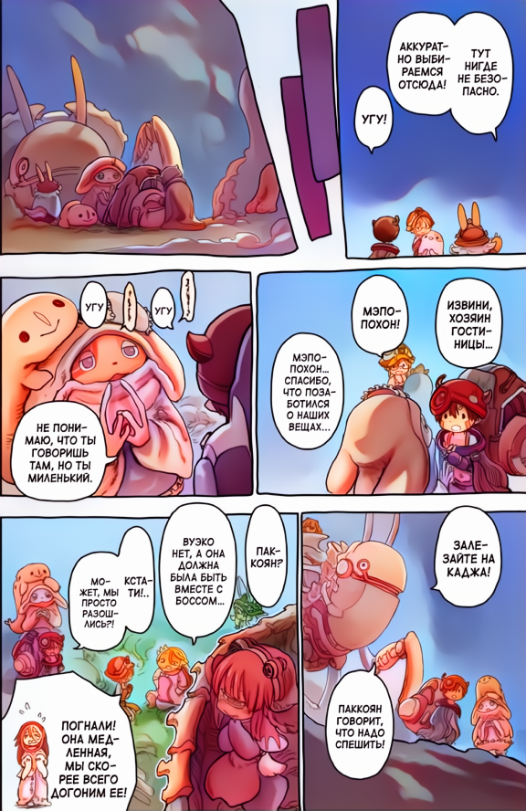 |
| 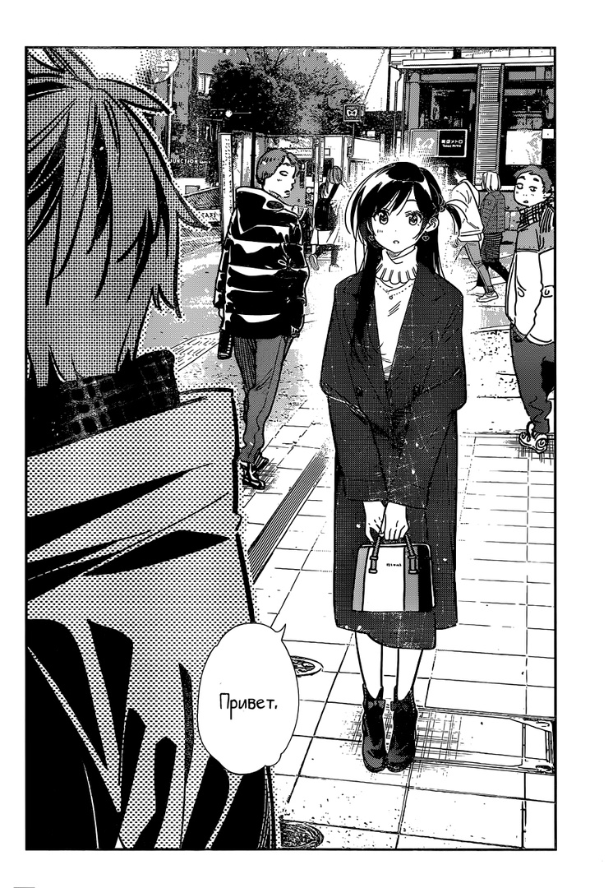 | 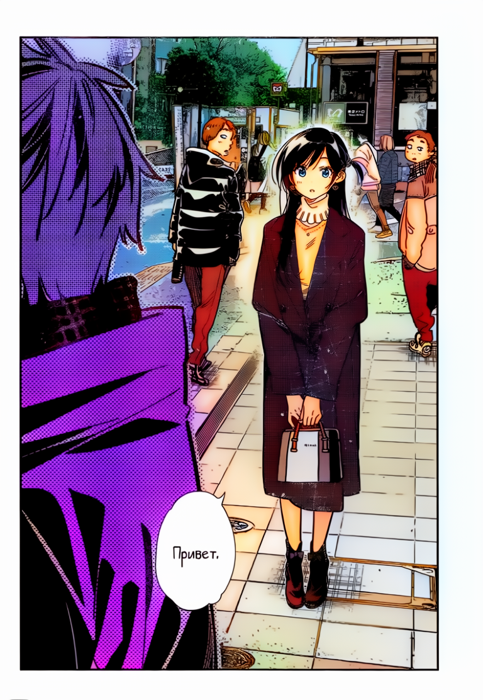 |
|  | 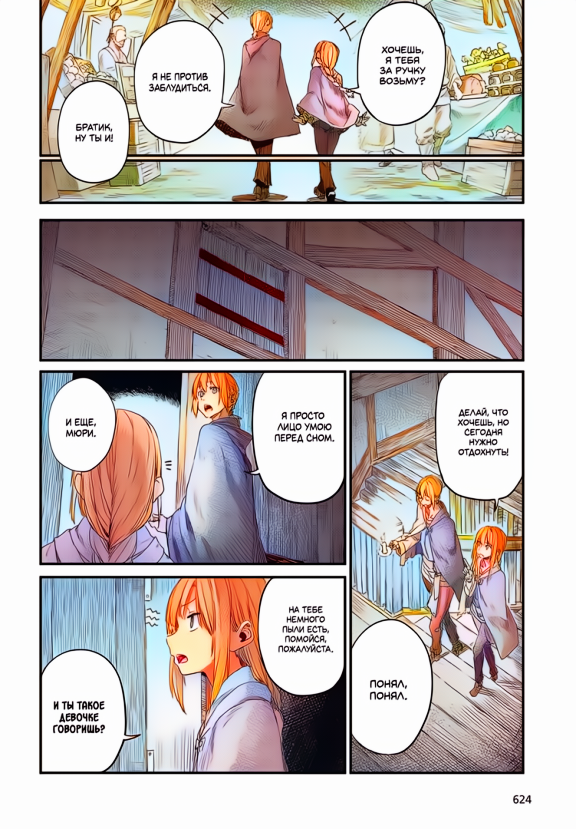 |
| 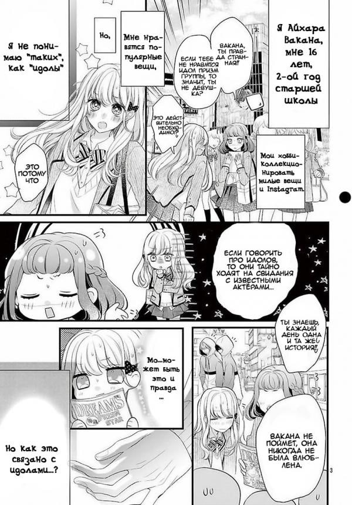 | 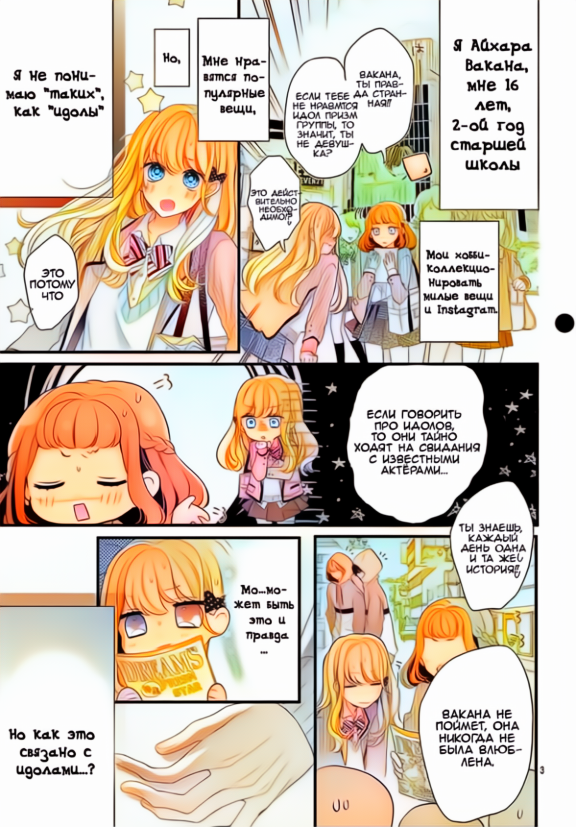 |
| 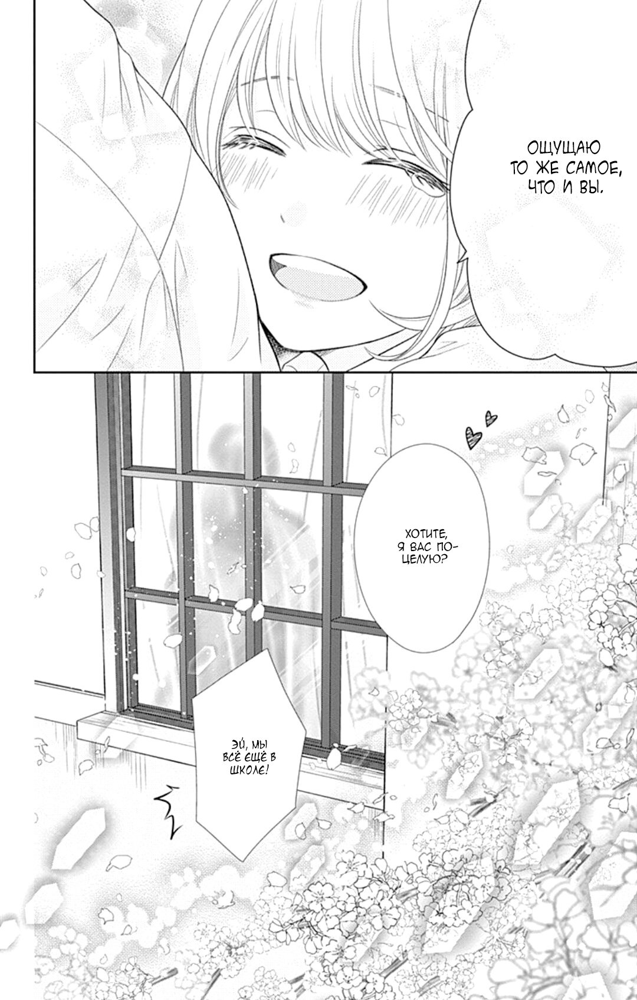 | 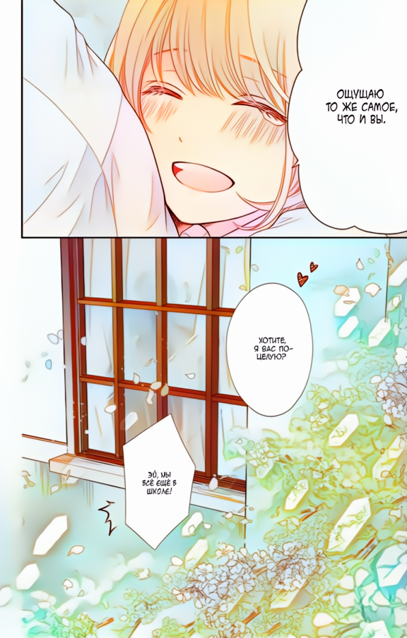 |
| 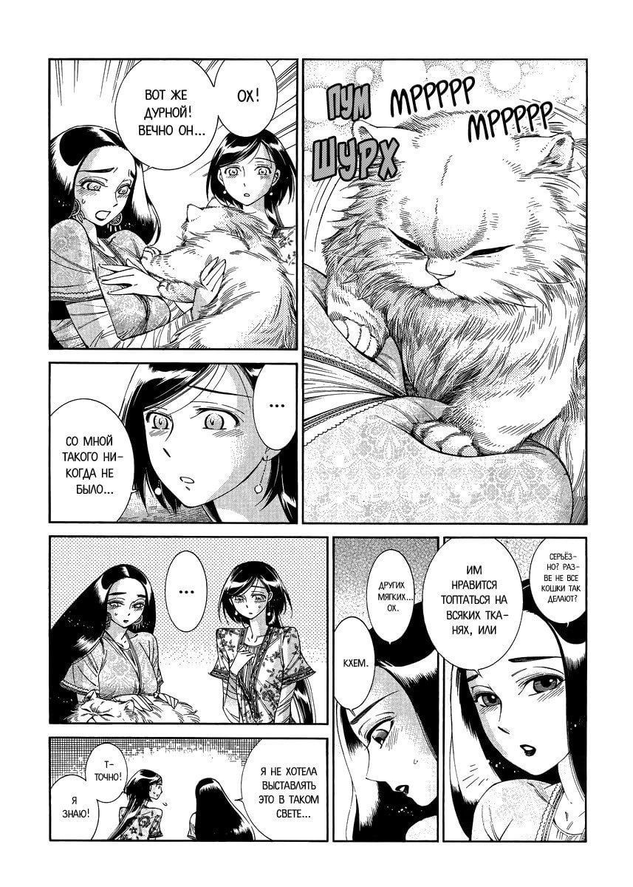 | 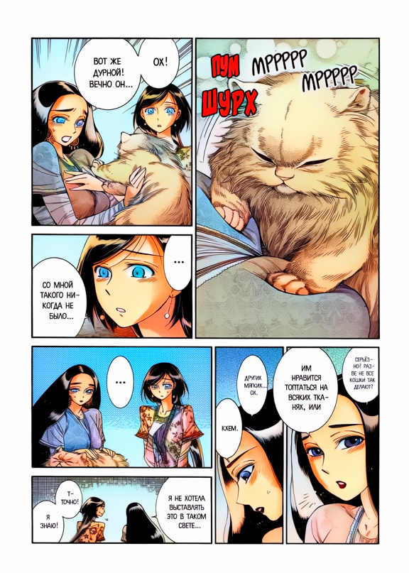 |
